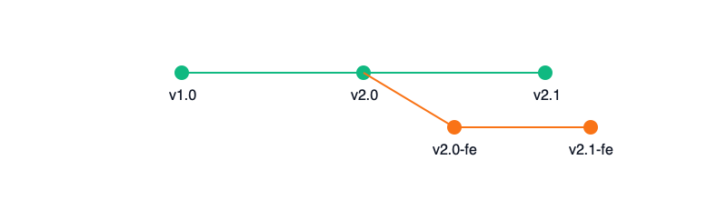
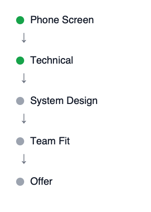
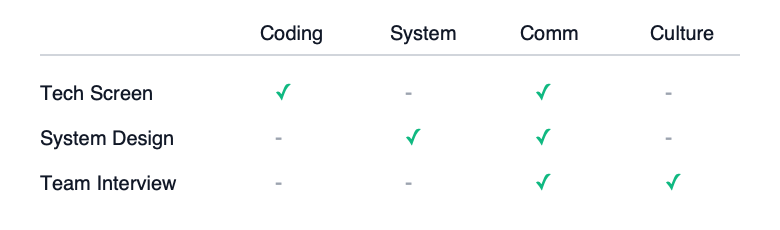
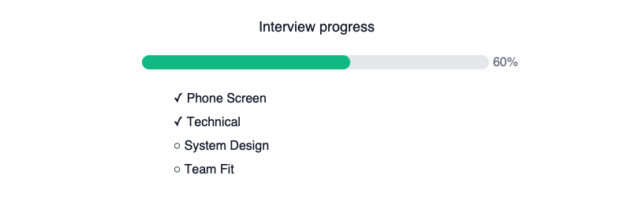
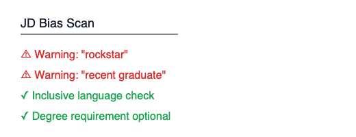

# Hiring as Code - Diagrams

This folder contains the visual diagrams used in the Hiring as Code framework and LinkedIn carousel.

Each diagram corresponds to one of the seven core pillars.

**License:** These diagrams are provided under the MIT License. You're free to use them in your own documentation, presentations, or training materials.

---

## 1. Version Controlled Job Descriptions

Shows how job descriptions evolve through semantic versioning, including branching for role variants.

---

## 2. Pipeline as Code

A minimalistic visual of a deterministic, step-by-step interview pipeline.

---

## 3. Test Suite Design

A compact competency coverage matrix, showing which interview stage evaluates which skills.

---

## 4. Continuous Integration for Feedback

A simple progress view showing interview completion status and bottlenecks.

---

## 5. Deployment and Rollback

A straightforward 30-60-90 day ramp-up timeline with checkpoints.

---

## 6. Monitoring and Observability

A minimal dashboard visual representing key hiring health metrics.

---

## 7. Security and Compliance

A compact bias scan display showing warnings and passes.

---

[← Back to main framework](../README.md)
